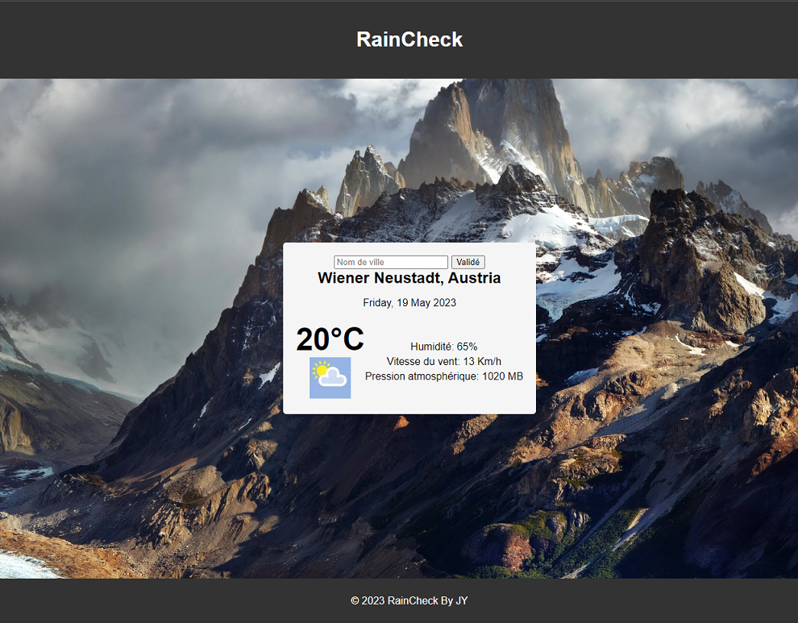

# Weather Application

## Creating a Weather Application with an API

The API chosen for our project is the `weatherstack.com` API.

### Launching the Application

To launch this application, you will need a personal API key from **weatherstack.com**.

- **Step 0**

  - Clone the project: `git clone git@github.com:Jean-Yves2/app_meteo.git`
  - Install the required packages with `npm install` if you are using **npm**

- **Step 1**

  - Register on the website.
  - In the Dashboard, you will find your **API key**.

- **Step 2**

  - Create a **.env** file.
  - Insert a variable `API_KEY='Your API key'`.
  - Choose a **PORT**, for example, `PORT=3000`.

- **Step 3**

  - In the console, run `node server` to launch the application.

## Application Page

